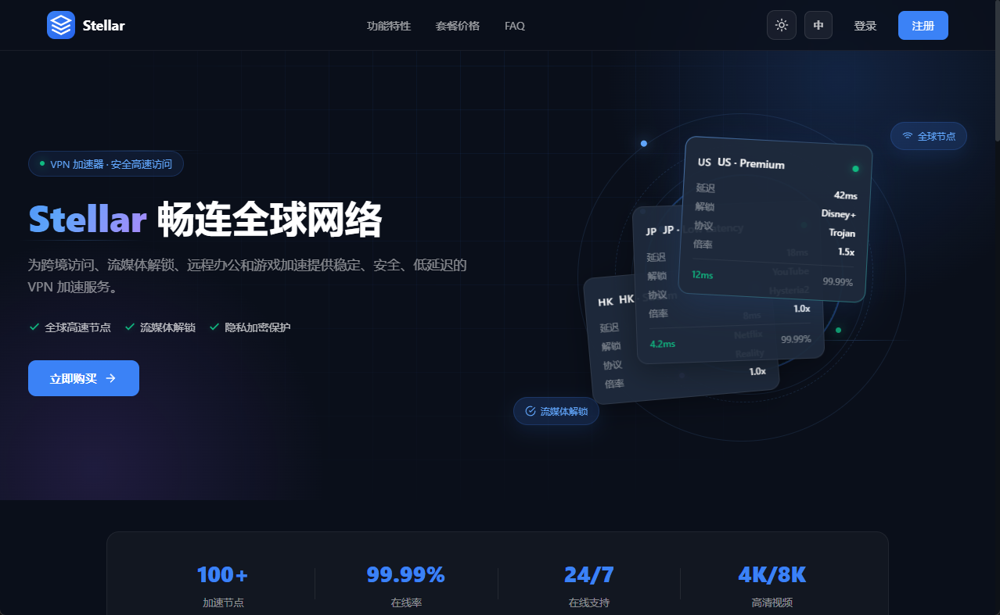
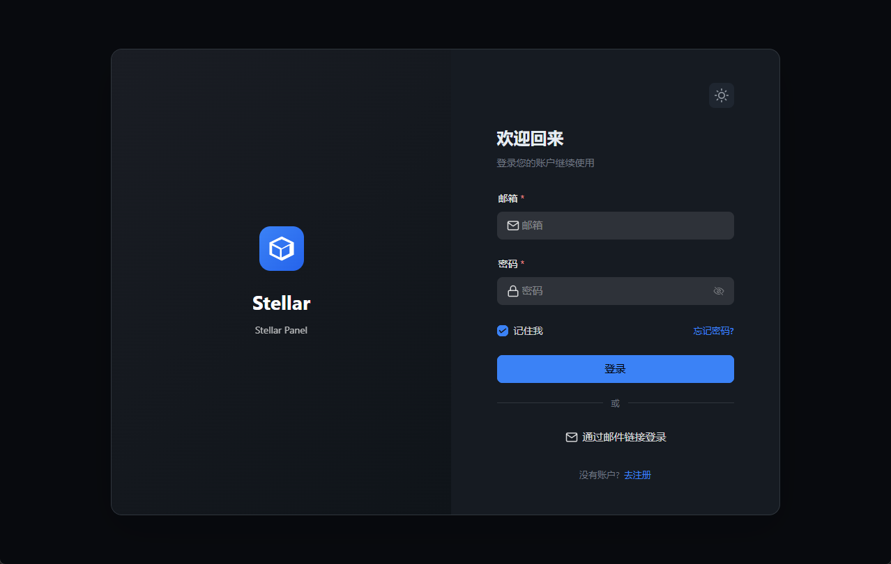
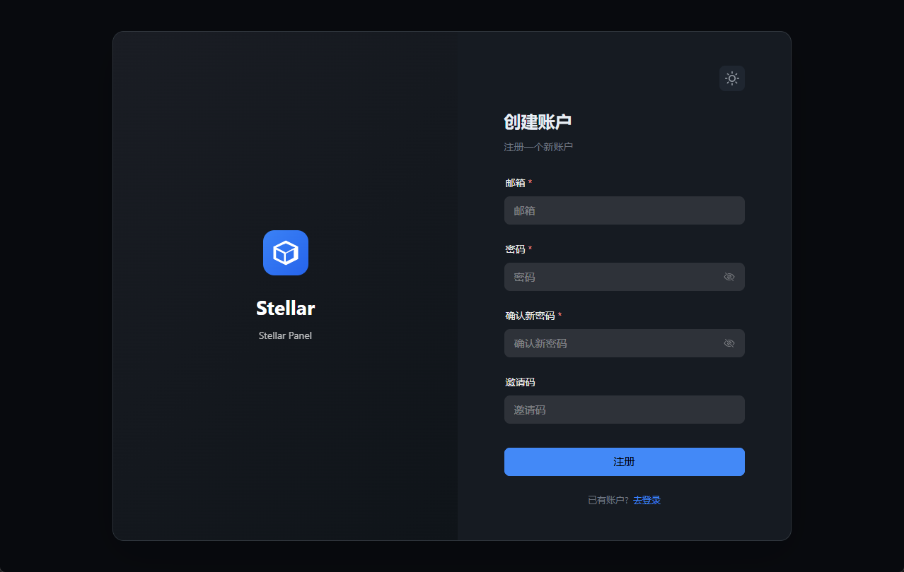

# 界面预览

## 🏠 落地页

访客首页，展示品牌信息、产品特点、服务数据和套餐列表。

## 🔑 认证页面

完整的用户登录和注册流程。

### 登录

支持用户名/邮箱登录、邮箱验证码登录等多种方式。

### 注册

新用户注册入口。

## 📊 用户控制台

登录后的用户中心，包含以下模块：

### 仪表盘

集中展示账户概况、套餐有效期、剩余流量、订阅导入和待处理事项提醒。

### 套餐

展示可购买的服务套餐，支持价格、周期和内容对比。

### 订单

查看历史订单和当前订单状态（待支付、已支付、已取消等）。

### 流量统计

通过图表展示流量使用趋势，支持不同时间范围查看。

### 服务器

查看可用节点信息和线路状态。

### 工单

提交工单、查看已有工单及处理状态。

### 邀请

邀请链接、邀请记录以及佣金相关数据。

### 知识库

帮助文章和常见问题，支持富文本内容展示。

### 个人资料

账户信息管理、密码修改和安全设置。

