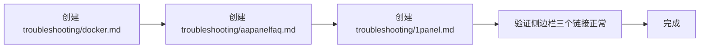

# Stellar Theme 文档规划（调整版）

## 现状

当前有效文档 9 篇，侧边栏 3 个链接指向未创建的 `troubleshooting/` 文件，访问会 404。

## 调整后的方案：仅修复侧边栏断裂

去掉 `guide/` 开发指南系列，只补全 `troubleshooting/` 三篇故障排查文档。

### 新建文档（3 篇）

| 文件 | 内容说明 | 素材来源 |
|------|---------|---------|
| [`troubleshooting/docker.md`](troubleshooting/docker.md) | Docker 部署常见问题：白屏、API 404、端口冲突、volume 挂载、镜像构建慢 | 从 [`install/docker.md`](install/docker.md) 故障排查表展开 |
| [`troubleshooting/aapanelfaq.md`](troubleshooting/aapanelfaq.md) | aaPanel 常见问题：Nginx 配置报错、SSL 申请失败、权限问题、502 | 从 [`install/aapanel.md`](install/aapanel.md) 常见问题展开 |
| [`troubleshooting/1panel.md`](troubleshooting/1panel.md) | 1Panel 常见问题：Compose 失败、伪静态不生效、目录选择受限 | 从 [`install/1panel.md`](install/1panel.md) 常见问题展开 |

### 需修改文件（1 处）

| 文件 | 修改内容 |
|------|---------|
| [`.vitepress/config.mts`](.vitepress/config.mts) | 侧边栏无需改动（链接路径已正确），仅确认三个 troubleshooting 链接正常 |

### 最终文档体系

```
📁 docs/
├── index.md                    # 首页
├── dashboard.md                # 项目总览+快速开始 ✅
├── output.md                   # 图片展示 ✅
│
├── install/                    # ── 部署指南 ──
│   ├── docker.md               # ✅
│   ├── aapanel.md              # ✅
│   ├── 1panel.md               # ✅
│   ├── vercel.md               # ✅
│   ├── github.md               # ✅
│   └── cloudflare.md           # ✅
│
├── config/
│   └── config.md               # ✅
│
├── troubleshooting/            # ── 新增：故障排查 ──
│   ├── docker.md               # 🔴 待创建
│   ├── aapanelfaq.md           # 🔴 待创建
│   └── 1panel.md               # 🔴 待创建
│
└── img/                        # 图片资源
```

### 总计

- **现有文档**：9 篇
- **新建文档**：3 篇
- **修改配置**：1 处
- **最终文档量**：12 篇

### 实施步骤


